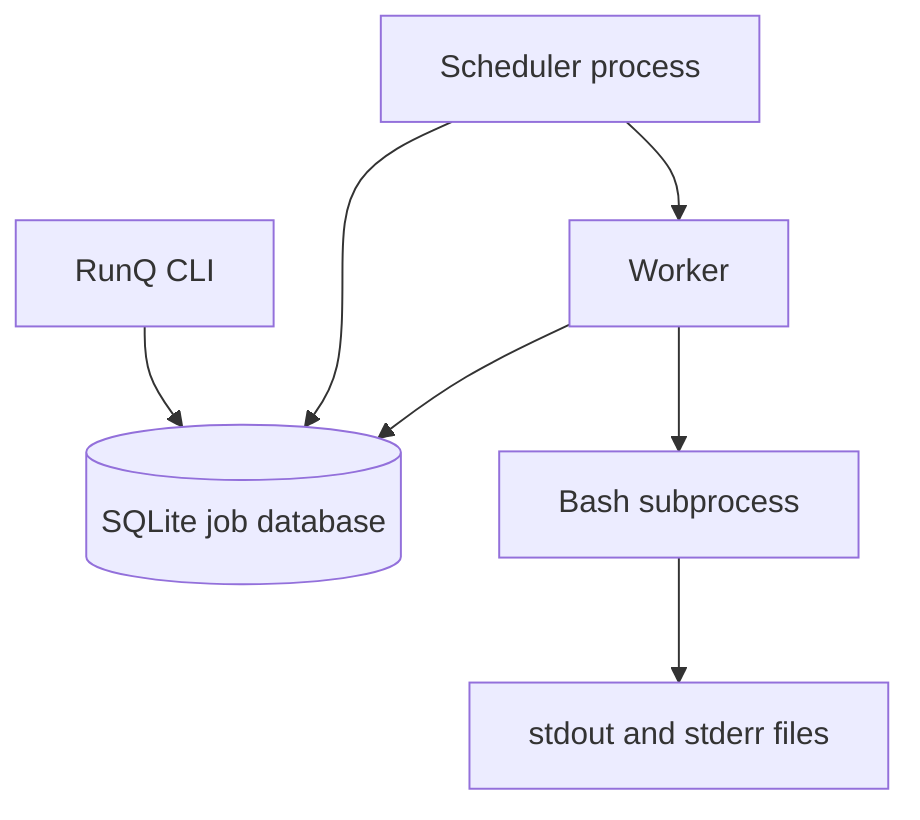
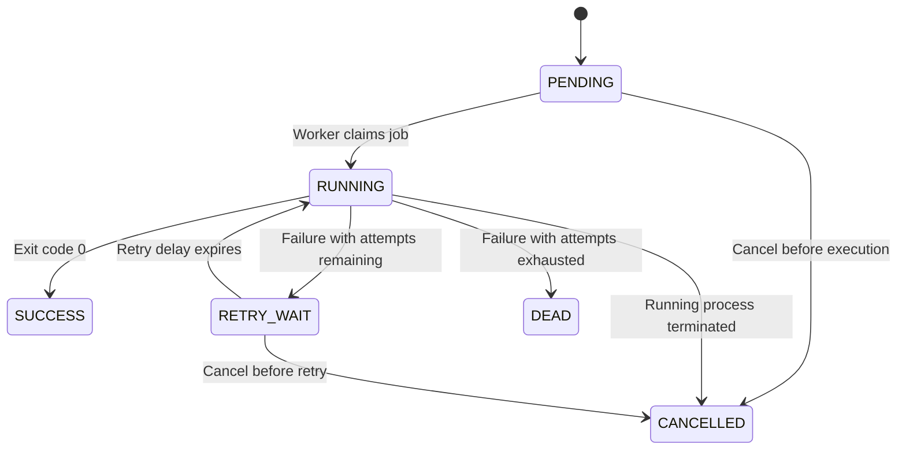

# RunQ

RunQ is a persistent, single-machine Linux job scheduler written in Python. It accepts shell commands as jobs, stores them in SQLite, selects runnable jobs by priority, executes them as Linux subprocesses, and records their state, exit code, standard output, and standard error.

The project is intentionally focused on operating-system, database, and concurrency fundamentals. It does not use a web frontend, Redis, Kafka, RabbitMQ, Kubernetes, or other distributed infrastructure.

## Why RunQ?

Job schedulers sit at the intersection of several important systems concepts:

- process creation and exit codes;
- stdout and stderr redirection;
- signals and process groups;
- thread-safe database access;
- atomic state transitions;
- priority queues and retry policies;
- persistence and recovery after failure.

RunQ explores these ideas in a small codebase that can be run and understood locally.

## Current features

- SQLite-backed job persistence
- CLI-based job submission and inspection
- Priority-based selection of runnable jobs
- Atomic job claiming with a single SQL statement
- Linux subprocess execution through Bash
- stdout and stderr capture in per-attempt log files
- Exit-code tracking
- Configurable maximum execution attempts
- Exponential-backoff retries
- Job states including `PENDING`, `RUNNING`, `RETRY_WAIT`, `SUCCESS`, `DEAD`, and `CANCELLED`
- Automated tests using temporary databases and log directories
- `logs` CLI command with stdout, stderr, attempt, and tail options
- Running-process cancellation using Linux process groups
- Lease-based recovery of jobs abandoned by a crashed scheduler
- Full restart and recovery integration tests

## Architecture



The CLI and scheduler communicate through SQLite. A worker atomically claims one runnable job, starts a Bash subprocess, waits for its completion, and writes the result back to the database.

In the concurrent version, each worker will use its own SQLite connection. SQLite permits concurrent readers and serializes writes, while Write-Ahead Logging improves read/write concurrency.

## Job lifecycle



`SUCCESS`, `DEAD`, and `CANCELLED` are terminal states. `RETRY_WAIT` is a durable waiting state used when an execution attempt fails but the job still has attempts remaining.

## Technology

- Python 3.11 or later
- SQLite 3.35 or later
- Linux or WSL2 Ubuntu
- `argparse` for the command-line interface
- `subprocess.Popen` for process execution
- `pytest` for testing
- Ruff for linting


## Installation on WSL2 Ubuntu

### 1. Clone the repository

```bash
git clone https://github.com/Sanjana272621/RunQ.git
cd RunQ
```

### 2. Create a virtual environment

```bash
python3 -m venv .venv
source .venv/bin/activate
```

### 3. Install RunQ in editable mode

```bash
pip install -e ".[dev]"
```

Editable installation creates the `jobsched` command and allows source-code changes to take effect without reinstalling the package after every edit.

### 4. Initialize the database

```bash
jobsched init
```

By default, RunQ creates its database at:

```text
var/scheduler.db
```

## Usage

### Submit a job

```bash
jobsched add --command "echo 'Hello from RunQ'"
```

Submit a higher-priority job with a custom attempt limit:

```bash
jobsched add \
  --priority 100 \
  --max-attempts 3 \
  --command "python3 scripts/process_data.py"
```

Higher numeric values represent higher priority.

### List jobs

```bash
jobsched list
```

Filter by state:

```bash
jobsched list --state PENDING
```

Limit the number of displayed jobs:

```bash
jobsched list --limit 20
```

### Inspect a job

```bash
jobsched status 1
```

The status view includes the command, state, priority, attempt count, timestamps, worker ID, process ID, exit code, log paths, and last error.

### Execute one runnable job

```bash
jobsched run --workers 1 --once
```

`--once` makes the scheduler execute at most one runnable job and then exit. This is useful for testing state transitions.

### Run the scheduler continuously

```bash
jobsched run --workers 1
```

The scheduler continues polling SQLite until interrupted with `Ctrl+C`.

### Configure polling and retry delay

```bash
jobsched run \
  --workers 1 \
  --poll-interval 0.5 \
  --retry-base-delay 2
```

### Read the current log files

Until the dedicated `logs` command is implemented, use the paths displayed by `jobsched status`:

```bash
cat var/logs/job-1-attempt-1.stdout.log
cat var/logs/job-1-attempt-1.stderr.log
```

Each attempt receives separate stdout and stderr files, preventing a retry from overwriting the output of an earlier attempt.


## Subprocess execution

RunQ executes a submitted command using:

```python
subprocess.Popen(
    ["/bin/bash", "-lc", command],
    stdout=stdout_file,
    stderr=stderr_file,
    start_new_session=True,
)
```

`Popen` allows RunQ to store the child PID, wait for completion, inspect the exit code, capture output, and later terminate the complete process group during cancellation.

An exit code of `0` produces `SUCCESS`. A non-zero exit code triggers a retry when attempts remain, or `DEAD` when the configured limit is exhausted.

## Retry policy

RunQ uses exponential backoff:

```text
retry delay = base delay × 2^(attempt number - 1)
```

With a base delay of two seconds:

| Failed attempt | Delay before next attempt |
|---:|---:|
| 1 | 2 seconds |
| 2 | 4 seconds |
| 3 | 8 seconds |

`max_attempts` represents the total number of executions, including the first attempt.

## SQLite configuration

Every RunQ database connection enables:

```sql
PRAGMA foreign_keys = ON;
PRAGMA journal_mode = WAL;
PRAGMA busy_timeout = 5000;
```

- Foreign-key enforcement protects relational integrity as additional tables are introduced.
- Write-Ahead Logging permits readers to continue while another connection writes.
- The busy timeout makes a connection wait briefly for a write lock rather than failing immediately with `database is locked`.

SQLite serializes writes, which is appropriate for RunQ's intentionally single-machine design.

